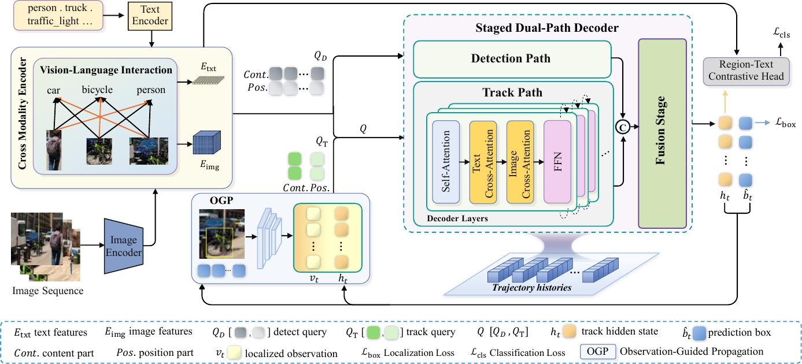
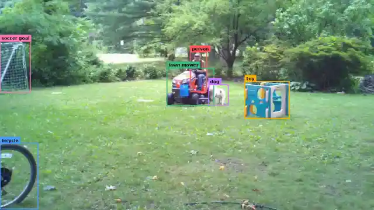
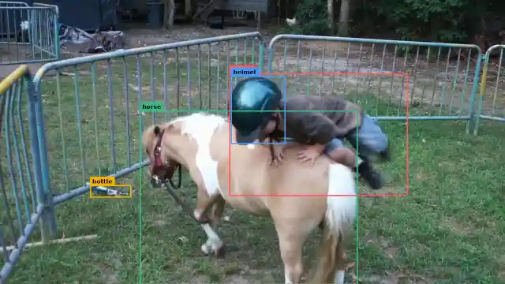
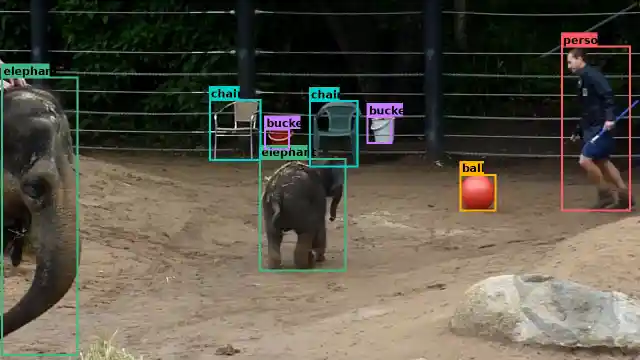
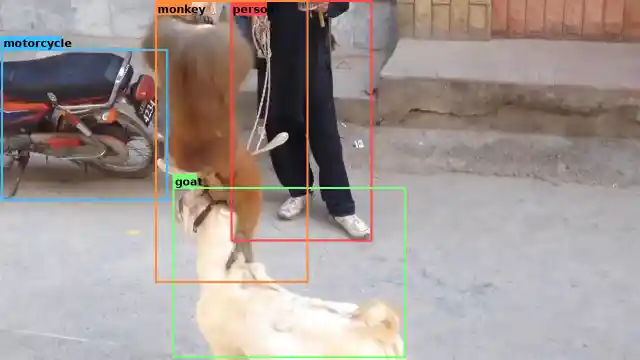
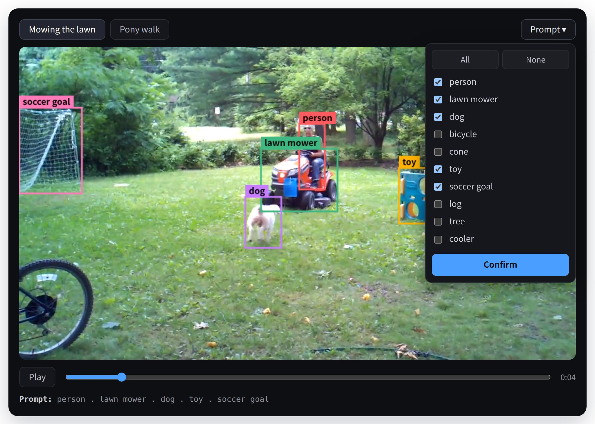
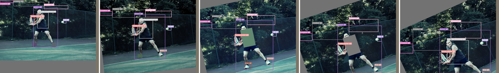
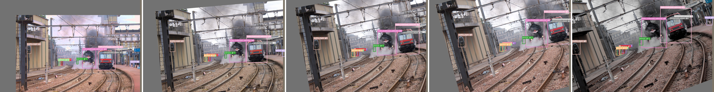
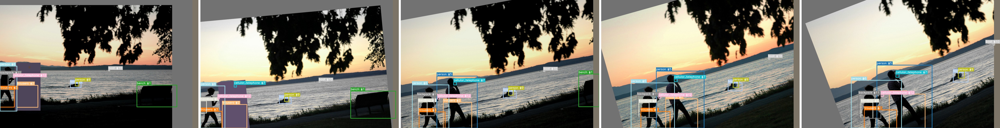

<div align="center">

# Unlocking the Ingrained Tracker in Grounding DINO for Open-Vocabulary Multi-Object Tracking

Haoyu Pan<sup>1</sup>, Jinxi Liu<sup>1</sup>, Shuo Zhang<sup>1</sup>,
Zhiyi Shi<sup>2</sup>, Yuhao Qiu<sup>1</sup>, Edmond Qi Wu<sup>1,\*</sup>

<sup>1</sup> School of Computer Science, Shanghai Jiao Tong University &nbsp;·&nbsp;
<sup>2</sup> School of Automation and Intelligent Sensing, Shanghai Jiao Tong University
&nbsp;·&nbsp; <sup>\*</sup> Corresponding author

[](https://phywphd.github.io/INGRAIN/)
[](https://phywphd.github.io/INGRAIN/#try-it)

</div>

**INGRAIN** (*Tracking with **IN**herited **GR**ounding **A**lignment **IN**
the Native Vision–Language Query Space*) is an end-to-end tracking-by-query
framework built on Grounding DINO. INGRAIN performs object discovery,
open-vocabulary classification, and trajectory modeling within the native
vision–language query space.

## Overview



*Overall pipeline of INGRAIN. Detect queries initialized in the native
vision–language query space and propagated track queries are processed by a
staged dual-path decoder. Multi-depth trajectory memory interacts with the
corresponding decoder layers, and observation-guided propagation reconstructs,
updates, and continues track queries across observations.*

## Abstract

Open-vocabulary multi-object tracking (OV-MOT) aims to localize, recognize,
and consistently associate objects beyond a fixed training vocabulary.
However, current OV-MOT methods often use pretrained open-vocabulary detectors
mainly for frame-level perception, or derive their open-vocabulary
correspondence from an external model during tracking, leaving the alignment
already acquired in detector pretraining underexploited for trajectory
modeling. To address this limitation, we propose INGRAIN, an end-to-end
framework that directly integrates object discovery, open-vocabulary
classification, and trajectory modeling within the vision–language query space
inherited from a pretrained Grounding DINO. Specifically, a staged dual-path
decoder first separates open-vocabulary object discovery from trajectory
modeling, and then integrates them for joint reasoning. Multi-depth trajectory
memory provides long-range historical context throughout track decoding and
cross-frame propagation, and observation-guided propagation reconstructs each
track query with localized instance evidence from the current observation.
Extensive experiments show that INGRAIN establishes a new state of the art for
end-to-end OV-MOT on TAO, delivering strong association together with high
novel-category classification accuracy.

## Demo

INGRAIN tracks whatever category words it is given — including categories
absent from the training annotations. Click a preview to open the full-length
1280×720 video.

<table>
  <tr>
    <td align="center" width="50%">
      <a href="assets/videos/mower.mp4"></a>
      <br><sub>Mowing the lawn</sub>
    </td>
    <td align="center" width="50%">
      <a href="assets/videos/horse.mp4"></a>
      <br><sub>Pony walk</sub>
    </td>
  </tr>
  <tr>
    <td align="center" width="50%">
      <a href="assets/videos/elephant.mp4"></a>
      <br><sub>Elephants</sub>
    </td>
    <td align="center" width="50%">
      <a href="assets/videos/monkey.mp4"></a>
      <br><sub>Monkey and goat</sub>
    </td>
  </tr>
</table>

## Main Results

Open-vocabulary MOT on TAO. Novel and Base are the rare and frequent/common
LVIS category splits. †: also trained on TAO; \*: trained on base and novel
categories.

**TAO validation set**

| Method | Novel TETA | LocA | AssocA | ClsA | Base TETA | LocA | AssocA | ClsA |
|---|---|---|---|---|---|---|---|---|
| DeepSORT (ViLD)† | 21.1 | 46.4 | 14.7 | 2.3 | 26.9 | 47.1 | 15.8 | 17.7 |
| TETer†\* | 25.7 | 45.9 | 31.1 | 0.2 | 30.3 | 47.4 | 31.6 | 12.1 |
| OVTrack | 27.8 | 48.8 | 33.6 | 1.5 | 35.5 | 49.3 | 36.9 | 20.2 |
| OVTR | 31.4 | 54.4 | 34.5 | 5.4 | 36.6 | 52.2 | 37.6 | 20.1 |
| SLAck | 31.1 | 54.3 | 37.8 | 1.3 | 37.2 | 55.0 | 37.6 | 19.1 |
| **INGRAIN (ours)** | **38.9** | **61.1** | **38.9** | **16.6** | **41.1** | **61.5** | **39.2** | **22.6** |

**TAO test set**

| Method | Novel TETA | LocA | AssocA | ClsA | Base TETA | LocA | AssocA | ClsA |
|---|---|---|---|---|---|---|---|---|
| DeepSORT (ViLD)† | 17.2 | 38.4 | 11.6 | 1.7 | 24.5 | 43.8 | 14.6 | 15.2 |
| TETer†\* | 21.7 | 39.1 | 25.9 | 0.0 | 29.2 | 44.0 | 30.4 | 10.7 |
| OVTrack | 24.1 | 41.8 | 28.7 | 1.8 | 32.6 | 45.6 | 35.4 | 16.9 |
| OVTR | 27.1 | 47.1 | 32.1 | 2.1 | 34.5 | 51.1 | 37.5 | 14.9 |
| SLAck | 27.1 | 49.1 | 30.0 | 2.0 | 34.7 | 52.5 | 35.6 | 16.1 |
| **INGRAIN (ours)** | **37.5** | **59.5** | **37.4** | **15.7** | **38.7** | **60.5** | **38.4** | **17.1** |

**Closed-set results on TAO val.** GD-T/GD-B: Grounding DINO with
Swin-T/Swin-B; SLAck-T: SLAck with Swin-T.

| Method | TETA | LocA | AssocA | ClsA |
|---|---|---|---|---|
| ByteTrack (GD-T) | 31.0 | 47.4 | 26.4 | 19.1 |
| MASA (GD-B) | 34.9 | 51.8 | 37.6 | 15.4 |
| OVTR | 35.7 | 52.3 | 36.3 | 18.4 |
| SLAck-T | 35.5 | 52.2 | 38.9 | 15.6 |
| **INGRAIN (ours)** | **40.9** | **61.5** | **39.2** | **21.9** |

**Component ablation on the TAO validation set.** SDP: staged dual-path
decoder; OGP: observation-guided propagation; MDM: multi-depth trajectory
memory.

| SDP | OGP | MDM | TETA | LocA | AssocA | ClsA |
|:---:|:---:|:---:|---|---|---|---|
| | | | 29.9 | 51.4 | 21.2 | 17.0 |
| ✓ | | | 33.9 | 54.7 | 30.1 | 16.8 |
| ✓ | ✓ | | 36.9 | 57.6 | 34.3 | 18.8 |
| ✓ | ✓ | ✓ | **38.2** | **58.7** | **36.8** | **19.0** |

All experiments run on a single NVIDIA RTX PRO 6000 GPU; training the full
recipe takes about 16 GPU-days. Further ablations (split depth, memory depths,
memory aggregation, propagation input) are in the paper.

## Try it

<a href="https://phywphd.github.io/INGRAIN/#try-it"></a>

**Interactive demo** on the [project page](https://phywphd.github.io/INGRAIN/#try-it)
— click the image above. The demo opens already playing; pick a clip, open the
**Prompt** menu, compose any combination of the preset category words, and hit
**Confirm** — the clip plays from the start with INGRAIN's tracks for exactly
those words. The tracks were pre-computed by INGRAIN with the demo word list as
its prompt; the page only replays them, so no environment, GPU, or weights are
needed. For offline use, [`demo/index.html`](demo/index.html) is the same demo
as a single self-contained file (about 22 MB): download it and open it in a
browser.

| Clip | Demo word list |
|---|---|
| Mowing the lawn | `person . lawn mower . dog . bicycle . cone . toy . soccer goal . log . tree . cooler` |
| Pony walk | `person . horse . helmet . bottle` |

**Your own video** (requires a trained checkpoint; see
[Evaluation](#evaluation)):

```bash
python demo_video.py --video your.mp4 \
    --words "person . dog . bicycle" --checkpoint ckpt/ingrain.pth
```

The model is built exactly as in evaluation; the vocabulary is whatever word
list you give. An annotated `your_tracked.mp4` is written next to the input
(`--frames` accepts a directory of images instead; see `--help` for the
thresholds).

## Installation

```bash
git clone https://github.com/Phywphd/INGRAIN.git
cd INGRAIN

conda create -n ingrain python=3.12 -y
conda activate ingrain

# Install PyTorch first, from the official cu128 wheel index. The paper
# environment uses torch 2.10.0+cu128 with torchvision 0.25.0+cu128;
# any torch >= 2.8 built for CUDA 12.8 works, with matching torchvision.
pip install torch==2.10.0 torchvision==0.25.0

# mmcv ships no wheel and is compiled from source. Its build script needs a
# setuptools that still provides pkg_resources, and it has to see the torch
# installed above, so build isolation is turned off. A CUDA toolkit (nvcc)
# must be on PATH, and the compile takes a while.
pip install "setuptools<81" wheel
pip install --no-build-isolation -r requirements.txt
```

This repository vendors a patched Grounding DINO stack under
`third_party/mmgroundingdino/`, placed first on `sys.path` at import time, so
`mmdet` itself is not installed from PyPI — only `mmengine` and `mmcv`
(runtime ops) are needed. The TETA scorer is vendored under `teta/`.

### Data

Training and evaluation use the same annotation releases as the compared
methods, so the comparison on TAO is on identical data. Every file below is a
public release of prior work; none of them is derived here. The underlying
datasets are [LVIS](https://www.lvisdataset.org/) and
[COCO](https://cocodataset.org/) (training), [TAO](https://taodataset.org/)
(frames and validation annotations), and
[BURST](https://github.com/Ali2500/BURST-benchmark) (test annotations).

**This repository ships only `lvis_classes_v1.txt` (12 KB).** The remaining
files — about 17 GB of annotations and images, plus several hundred GB of TAO
frames — are too large to include; **we will release the prepared data
later.** The comments below describe each file's contents.

After downloading, you should end up with the following structure:

```
data/
├── lvis_classes_v1.txt          # provided: 1203 LVIS-v1 class names, in id order
├── lvis_base_train.json         # 365 MB — training annotations: LVIS and COCO
│                                #   labels merged, every rare-class annotation
│                                #   removed
├── lvis_train_images.h5         # 16 GB — training images as raw JPEG bytes,
│                                #   packed from the LVIS train set with rare-only
│                                #   images dropped
├── validation_ours_v1.json      # 107 MB — TAO validation annotations, aligned to
│                                #   the LVIS-v1 vocabulary
├── tao_test_burst_v1.json       # 45 MB — TAO test annotations, derived from the
│                                #   BURST benchmark
└── frames/                      # several hundred GB — official TAO download; only
    ├── val/                     #   val/ and test/ are needed (a symlink to the
    │   ├── ArgoVerse/           #   extracted TAO root is fine); one folder per
    │   ├── AVA/                 #   video, with the original TAO frame filenames
    │   ├── BDD/
    │   ├── Charades/
    │   ├── HACS/
    │   ├── LaSOT/
    │   └── YFCC100M/
    └── test/
        ├── ArgoVerse/
        ├── AVA/
        ├── BDD/
        ├── Charades/
        ├── HACS/
        ├── LaSOT/
        └── YFCC100M/
```

Training reads images from the HDF5 file, not from `frames/`; the frames are
needed only for TAO evaluation. If your copies live elsewhere or under
different names, point the environment variables below at them.

Overrides: `INGRAIN_ANN_FILE` (training annotations), `INGRAIN_H5_FILE`
(training images), `INGRAIN_CLASSES_FILE` (class list), `INGRAIN_TAO_VAL_ANN` /
`INGRAIN_TAO_TEST_ANN` (TAO annotations), `INGRAIN_TAO_IMG_ROOT` (frames root),
`INGRAIN_DATA_DIR` (base directory for all of the defaults).

Two hard requirements on the training annotations:

1. They must carry the LVIS `frequency` field. The training script uses it to
   separate base (frequent / common) from novel (rare) categories.
2. They must contain no annotation on a rare category. The training script counts
   them and aborts if any are found — this is the premise of the open-vocabulary
   protocol.

## Directory Structure

```
train.py                     training entry point
evaluate.py                  evaluation entry point (TAO validation / test)
inference.py                 track lifecycle at inference
demo_video.py                run INGRAIN on your own video
requirements.txt

ingrain/
  models/detector.py                 main model: per-observation forward,
                                     track propagation, loss accumulation
  models/trajectory_memory.py        multi-depth trajectory memory: banks and
                                     attention aggregation
  models/layers/                     decoder and decoder layers (staged
                                     dual-path)
  models/diag.py                     training diagnostics (--diag-log)
  losses/track_loss.py               classification and localization losses,
                                     matching, weight groups
  datasets/lvis_observation_seq.py   augmented observation sequences from
                                     LVIS still images
  structures/track_instances.py      trajectory container

eval/
  config.py                  data paths and inference hyper-parameters
  ingrain_runner.py          per-observation chunked inference
  tao_dataset.py             TAO sequence loading
  result_formatter.py        TAO JSON export
  evaluate_tao.py            TETA invocation
  results/                   video lists and evaluation output

scripts/
  train.sh                   training (paper recipe)
  eval.sh                    single evaluation run
  eval_test_full.sh          full TAO test, resumable
  score_partial_snapshot.py  score a mid-run snapshot

demo/                        interactive demo as a single offline HTML file
docs/                        project page (GitHub Pages): interactive demo,
                             videos, results
assets/                      architecture figure, demo previews and videos,
                             augmentation examples (README)
teta/                        vendored TETA scorer
third_party/
  mmgroundingdino/           vendored Grounding DINO stack
data/                        class-name list; downloaded data goes here
                             (layout detailed in the Data section above)
```

## Training

INGRAIN is trained on LVIS base categories only, with no TAO video: each
training sample is an augmented observation sequence built from a single LVIS
still image, for example:





Download the pretrained Grounding DINO Swin-T detector from the OpenMMLab
model zoo (MM-Grounding-DINO,
`grounding_dino_swin-t_pretrain_obj365_goldg_grit9m_v3det_20231204_095047-b448804b.pth`,
1.1 GB), then create `weights/` and save it there as `gd_swin_t.pth`:

```bash
mkdir -p weights
wget -O weights/gd_swin_t.pth https://download.openmmlab.com/mmdetection/v3.0/mm_grounding_dino/grounding_dino_swin-t_pretrain_obj365_goldg_grit9m_v3det/grounding_dino_swin-t_pretrain_obj365_goldg_grit9m_v3det_20231204_095047-b448804b.pth
```

Any other location works by setting `INGRAIN_WEIGHTS_DIR`, `INGRAIN_GD_CKPT`,
or `--gd-ckpt`; `train.py` prints the path it expects if the file is
missing. This public base checkpoint is all that training needs.

- **Train INGRAIN (paper recipe)**
```bash
bash scripts/train.sh
```
The script encodes the full recipe — architecture switches, sequence-length
curriculum, loss weights, per-group learning rates — documented in its header.
Running `train.py` by hand does not reproduce the paper unless you supply the
same flags.

- **Resume an interrupted run**
```bash
RESUME=/path/to/checkpoint.pth bash scripts/train.sh
```

- **Train an ablation variant** (switch a component off at build time)
```bash
INGRAIN_HIDDEN_FUSE=0 bash scripts/train.sh
```

## Evaluation

Evaluation reports TETA and its components (LocA / AssocA / ClsA) on base and
novel categories, under the protocol of the Main Results tables above. Trained
INGRAIN checkpoints are not included yet — **we will release our model
later.**

- **Evaluate on the TAO validation set**
```bash
# eval.sh <ckpt> <tag> <split> <video-list filename> <n videos> [filter_thresh]
bash scripts/eval.sh /path/to/ckpt.pth myrun val val_FULL988_video_list.txt 988
```

- **Evaluate on the full TAO test set** (1419 videos, resumable, disk-guarded)
```bash
CKPT=/path/to/ckpt.pth TAG=myrun bash scripts/eval_test_full.sh
```

Predictions and scores are written to `eval/results/<tag>/`; the run ends by
printing the TETA / LocA / AssocA / ClsA rows and saving the same summary
alongside the predictions.
Protocol: the full 1203-category LVIS-v1 taxonomy is used as the evaluation
vocabulary; each track's positional reference is its own predicted box from
the preceding observation; under the standard entrance-and-exit lifecycle, a
trajectory inactive for 5 consecutive observations is removed.

## License

This code is provided under the [Apache License 2.0](LICENSE). The vendored
Grounding DINO stack and TETA evaluator keep their original
licenses and notices; parts of the data-augmentation implementation are
adapted from the OVTR release (MIT License).
